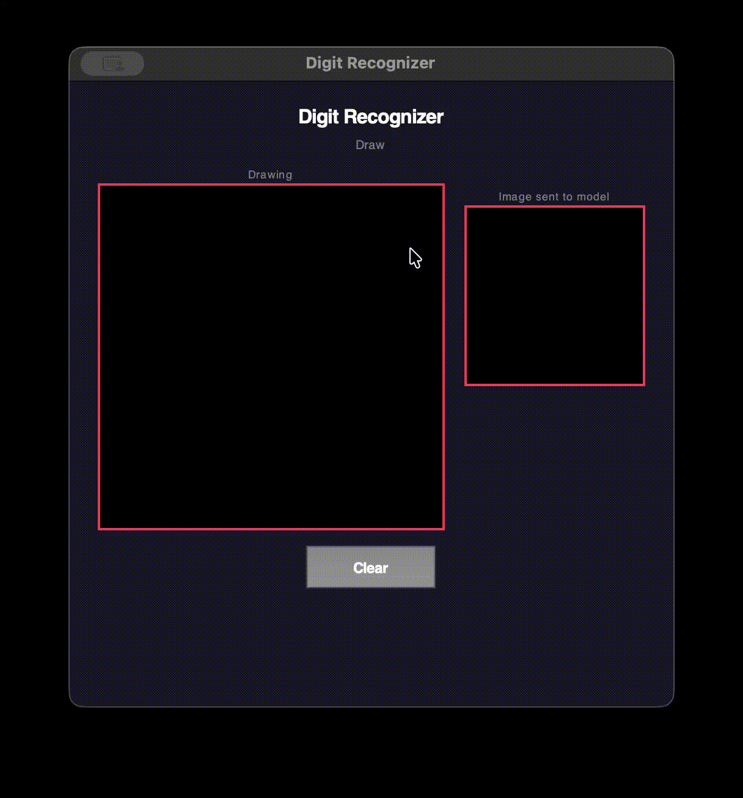

# ARM64 Assembly MNIST Digit Recognizer

This project implements a handwritten digit recognizer where the **neural network inference is executed in ARM64 assembly**.

The model is trained using **TensorFlow/Keras**, but the **forward pass (dense layers, ReLU, softmax, and argmax)** is implemented manually in assembly to understand how neural networks run at a low level.

The system connects a Python drawing interface to an ARM64 inference engine through a C runtime.

---

# Demo

Draw a digit in the GUI and the model predicts the number in real time.



---
# System Architecture
[](https://mermaid.live/edit#pako:eNqtVN1umzAYfRXLU6VWowxIAsQXk9LQTb1IG5H0YiNT5IBJrIKNbLM2_XmOPdBebDaQjG3aNE3zBbLP933Hn4-PeYIpzwhEcCtwtQPLaMWAHicn4FrjICI5ZVRRzmQbmH9I5nu14wy8v71CIBP4fo1Ztq4EyWiq7Gr_qUuML0-98OsXLwRzQSrBUyIlZduzNnxxdZ1kWOE3iki1zuiWKntDWVc8jZfJFMQ1U7QkCDQ5lOVEEJYSO-2y2q-sN23vk8UMJJN45g_BREpSboo9AoKkfMvoIxG27MrMiOIkI0yStSBF3ccXHS55rkr80AtNZgkW2-8YYdmKtdOb22UybwXQSoGbWlW16tLiy8VpZI4HXmsh-AZvaKEFJfLsUK21flfw-4O-4Pz87fPyjjJFBJhi9hnLZ6PmUdYm4YIyLPbgiumdno2aR1lN2Ah4VLIBtDgtYFQygO752HwD6EZ7HS3UvtC3BU6nvOBCdreWFlhK7QlQtR7IaVGgV4Mg8CcXllSC3xH0Ks_zbn5-TzO1Q171YKWGpon9xGRM0PHkg3Hqer_ncf_Ek4rWLR2X44zG4-k_cuHOPv_jfLwxQ8fkBZj4zt931eMyzmhV_wHUdvgVNS4wuvYxY4SDRn1c-8GKYitaWJPZ8eD9BO0PS3ujOwi09J-CZhApURMLlkSU2Czhk6lZQbUjmh8iPc2wuFvBFXvRNRVmHzkvD2WC19sdRDkupF7VlW6WRBTrd1weUf3WMyKmXLcM0XDkNiQQPcEHiLzAtX3fdbxB6I-Hg0AH9xAFvh36bjD2Qmc4CjzHe7HgY7OrY4cmdRiMQscd-sHYffkGab2UhQ)

---

# Neural Network Architecture

```
Input Layer (784 pixels)
        │
        ▼
Dense Layer (256) + ReLU
        │
        ▼
Dense Layer (128) + ReLU
        │
        ▼
Dense Layer (64) + ReLU
        │
        ▼
Dense Layer (10)
        │
        ▼
Softmax
        │
        ▼
Digit Prediction
```

---


#  Pipeline: Digit Prediction Flow

<details>
<summary><b>Click to expand: Full Step-by-Step Flow</b></summary>


## 1) Draw a Digit 
User draws a digit in the **Python GUI (Tkinter Canvas)**.


## **2) Convert to 28×28 Image**
The drawing is transformed into a **28×28 grayscale image**.


## **3) Flatten into Vector**
The image is flattened into a **784-element vector** for processing.


## **4) Save to Binary File**
The input vector is written to a **binary file** (`data/test_digit.bin`).


## **5) Load Input & Weights**
A **C runtime** loads the input and neural network weights.


## **6) Run ARM64 Assembly Inference**
The C runtime calls **ARM64 assembly kernels** to compute the forward pass.


## **7) Output Prediction**
The predicted digit and its **probabilities** are returned to the GUI.


</details>


# Running

Start the drawing interface:

```
python draw_and_predict.py
```

Draw a digit and the model will predict it.

---

# Technologies Used


## 💡 What I Learned

- ## Neural Networks = Matrix Multiplications  
  Understood how neural networks fundamentally reduce to **matrix operations** at the core.

- ## Inference Engine Mechanics
  Learned how models execute internally and how **forward passes** are computed efficiently.

- ##  Low-Level Optimizations Matter  
  Saw how high-level ML frameworks rely on **assembly-level or optimized kernels** for speed.

- ## Software Layer Integration 
  Explored how Python, C, and Assembly interact seamlessly to build a **full-stack ML pipeline**.
